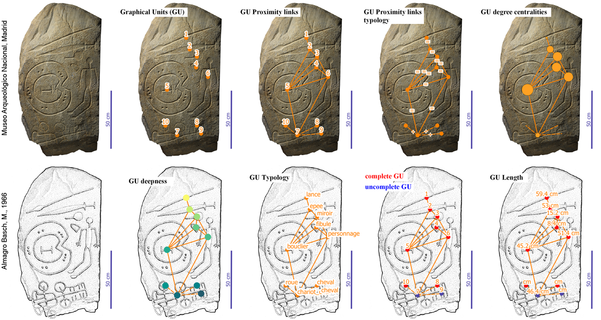

[](https://github.com/zoometh/iconr/actions) [](https://travis-ci.org/zoometh/iconr)
          
# ***iconr*** package <br> modeling Prehistoric iconography 
> Created by [Thomas Huet](mailto:thomashuet7@gmail.com), [Jose M Pozo](mailto:josmpozo@gmail.com), [Craig Alexander](mailto:craiga304@gmail.com)
  
  
  
The R package ***iconr*** is grounded in graph theory and spatial analysis to offer concepts and functions for modeling Prehistoric iconographic compositions and preparing for further analysis (clustering, typology tree, Harris diagram, etc.). The package purpose is to contribute to cross-cultural comparison through a greater normalization of quantitative analysis. 



To get and install the latest development version from GitHub:

```
devtools::install_github("zoometh/iconr", build_vignettes=TRUE)
```

Check the ***iconr*** documentation [**here**](https://zoometh.github.io/iconr/docs/)
