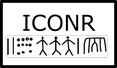

[](https://CRAN.R-project.org/package=iconr)
[](https://joss.theoj.org/papers/e68e041e66a613918f76bf43db3f8b02)
[](https://doi.org/10.5281/zenodo.4767529)
[](https://github.com/zoometh/iconr/actions) [](https://travis-ci.org/zoometh/iconr)
          
# ***iconr*** package <br> modeling Prehistoric iconography 
> Created by [Thomas Huet](mailto:thomashuet7@gmail.com), [Jose M Pozo](mailto:josmpozo@gmail.com), [Craig Alexander](mailto:craiga304@gmail.com)
  
  
The R package ***iconr*** is grounded in graph theory and spatial analysis to offer concepts and functions for modeling Prehistoric iconographic compositions and preparing for further analysis (clustering, typology tree, Harris diagram, etc.). The package purpose is to contribute to cross-cultural comparison through a greater normalization of quantitative analysis.   
  
  

  
  
To install the stable version from the CRAN:

```
install.packages("iconr")
```

To get and install the latest development version from GitHub:

```
devtools::install_github("zoometh/iconr", build_vignettes=TRUE)
```

Check the ***iconr*** web site [**here**](https://zoometh.github.io/iconr/articles/index.html). To cite the package, please use this [article](https://joss.theoj.org/papers/10.21105/joss.03191) as the most recent reference:

```
@article{Huet2021,
  doi = {10.21105/joss.03191},
  url = {https://doi.org/10.21105/joss.03191},
  year = {2021},
  publisher = {The Open Journal},
  volume = {6},
  number = {61},
  pages = {3191},
  author = {Thomas Huet and Jose M. Pozo and Craig Alexander},
  title = {Analysis of Prehistoric Iconography with the R package iconr},
  journal = {Journal of Open Source Software}
}
```
See also, how to [contribute](.github/CONTRIBUTING.md) to the next package release, and how to [report an issue](https://github.com/zoometh/iconr/issues) using the [issue template](.github/ISSUE_TEMPLATE.md).

## Next release

The next release of the R package ***iconr*** package will be focused on management of graphical units (GUs)

### Shape Analysis

Perform shape analysis on GUs with the R package [Momocs](https://momx.github.io/Momocs/articles/Momocs_intro.html)

ex: [ex1](https://zoometh.github.io/iconr/articles/next.html#shape-analysis-1)  

### Tree-like structures

Create hierarchical _thesaurus_ (tree-like) for GUs' typology (also needed for other variable like 'technique'). Identity between GU name and value must be unique (URL). For example:

.[GUs](https://zoometh.github.io/iconr/articles/img/typo_gu_ug.html)   
   |-- [geometric](https://zoometh.github.io/iconr/articles/img/typo_gu_geometrique.html)  
   |-- [figurative](https://zoometh.github.io/iconr/articles/img/typo_gu_figuratif.html)    
   |   |-- [zoomorphic](https://zoometh.github.io/iconr/articles/img/typo_gu_zoomorphe.html)
   |   |-- [technomorphic](https://zoometh.github.io/iconr/articles/img/technomorphe.html)  
   |   |-- [anthropomorphic](https://zoometh.github.io/iconr/articles/img/typo_gu_anthropomorphe.html)  


### DAGs

Directed Acyclic Graphs (DAGs) for stratigraphy, to perform on-the-fly Harris matrices of the objects' graphical contents

ex: [ex1](https://zoometh.github.io/iconr/articles/next.html#harris-matrix-1)   


