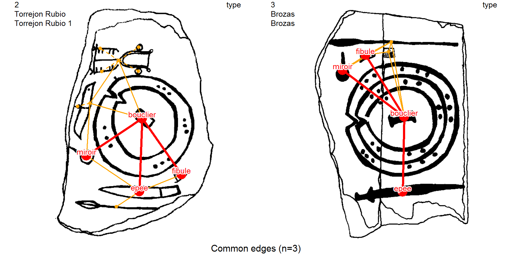

[](https://CRAN.R-project.org/package=iconr)
[](https://joss.theoj.org/papers/e68e041e66a613918f76bf43db3f8b02)
[](https://doi.org/10.5281/zenodo.4767529)
[](https://github.com/zoometh/iconr/actions) [](https://travis-ci.org/zoometh/iconr)
          
# ***iconr*** R package <br> modeling Prehistoric iconography 
> Created by [Thomas Huet](mailto:thomashuet7@gmail.com), [Jose M Pozo](mailto:josmpozo@gmail.com), [Craig Alexander](mailto:craiga304@gmail.com)
  
The ***iconr*** R package purpose is to contribute to cross-cultural comparison of iconography through a greater normalization of quantitative analysis. The package [stable version](https://github.com/zoometh/iconr/#iconr-stable-version-the-analysis-of-compositions) deals with composition analysis[^1], the package [development version](https://github.com/zoometh/iconr/#iconr-development-version-the-analysis-of-compositions-and-geometric-morphometry) deals with both composition and geometric morphometric.
  
---  
  
The R package ***iconr*** is grounded in graph theory, spatial analysis (composition analysis), and shape analysis (geometric morphometric) to offer concepts, measurments and functions for modeling Prehistoric iconography and preparing for further analysis (clustering, typology tree, Harris diagram, etc.). The theoretical background is as follows:  
  * Some objects (eg, pottery, rock panels) can have a decoration;
  * A decoration is composed of graphical units (GUs);
  * GUs can be drawn as LINES or POLYGONS (2D);
  * Shape analysis can measures the similarities between two GUs (eg. Procrustes distance)
  * GUs are considered as nodes;
  * Nodes have neighbourhood relations one with another depending on their spatial proximities;
  * A decoration is considered as a graph and can be analyzed with Graph Theory.
  * Local indices can be calculated for every nodes (eg. degree centrality);
  * In terms of composition: each decoration (i.e. graph) can be compared to another decoration on the basis of local or global indices (e.g. degree distribution);
  * In terms of shapes: each decoration can be compared to another decoration on the basis of their shape indices;
  
As favored [GIS entry](https://zoometh.github.io/iconr/articles/gis.html), GIS indices (*x* and *y* dimensions) can also be used. 

---
See how to [contribute](.github/CONTRIBUTING.md) to the next package release; how to [report an issue](https://github.com/zoometh/iconr/issues) using the [issue template](.github/ISSUE_TEMPLATE.md).

## Stable version: the Analysis of Compositions

The ***iconr*** v. 0.1.0 stable version can be installed from the [CRAN](https://cran.r-project.org/web/packages/iconr/index.html). It allows GUs [composition analysis](#iconr-stable-version-the-analysis-of-compositions))

```
install.packages("iconr")
```

The v. 0.1.0 allows the analysis of compositions

<center>
  

  
</center>
  

Photograph of Solana de Cabañas (Extremadura, Spain) Late Bronze Age stele[^2] [**1**]. Graphical units (GUs) drawing [**2**]. Each GU is recorded with a vertex (POINT) [**3**], and each contiguous vertex (Voronoi cell) is linked with an edge [**4**, **5**]. 

See the [package vignette](https://zoometh.github.io/iconr/)

### Overview of the functions for the analysis of compositions

The ***iconr*** v. 0.1.0 functions' descriptions and examples are available on this [website](https://zoometh.github.io/iconr/articles/index.html). 

#### Description

The package as a sample of 5 decorations[^3]:

<table>
 <thead>
  <tr>
   <th style="text-align:right;"> idf </th>
   <th style="text-align:left;"> site </th>
   <th style="text-align:left;"> decor </th>
   <th style="text-align:left;"> img </th>
  </tr>
 </thead>
<tbody>
  <tr>
   <td style="text-align:right;"> 1 </td>
   <td style="text-align:left;"> Cerro Muriano </td>
   <td style="text-align:left;"> Cerro Muriano 1 </td>
   <td style="text-align:left;"> Cerro_Muriano.Cerro_Muriano_1.jpg </td>
  </tr>
    <tr>
   <td style="text-align:right;"> 2 </td>
   <td style="text-align:left;"> Torrejon Rubio </td>
   <td style="text-align:left;"> Torrejon Rubio 1 </td>
   <td style="text-align:left;"> Torrejon_Rubio.Torrejon_Rubio_1.jpg </td>
  </tr>
    <tr>
   <td style="text-align:right;"> 3 </td>
   <td style="text-align:left;"> Brozas </td>
   <td style="text-align:left;"> Brozas </td>
   <td style="text-align:left;"> Brozas.Brozas.jpg </td>
  </tr>
    <tr>
   <td style="text-align:right;"> 4 </td>
   <td style="text-align:left;"> Zarza de Montanchez </td>
   <td style="text-align:left;"> Zarza De Montanchez </td>
   <td style="text-align:left;"> Zarza_de_Montanchez.Zarza_De_Montanchez.jpg </td>
  </tr>
  <tr>
   <td style="text-align:right;"> 5 </td>
   <td style="text-align:left;"> Ibahernando </td>
   <td style="text-align:left;"> Ibahernando </td>
   <td style="text-align:left;"> Ibahernando.Ibahernando.jpg </td>
  </tr>
</tbody>
</table>

<table style="width:80%">
	<tr align="center">
  		  <th style="padding:5px">1</th>
        <th style="padding:5px">2</th>
			  <th style="padding:5px">3</th>
		    <th style="padding:5px">4</th>
        <th style="padding:5px">5</th>
	</tr>
	<tr align="center">
		<td>
    		
		</td><td>
    			
		</td><td>
				
		</td><td>
				
		</td><td>
    		
		</td>
	</tr><tr>
  		  <th style="padding:5px">Cerro Muriano, stele 1</th>
        <th style="padding:5px">Torrejon Rubio, stele 1</th>
			  <th style="padding:5px">Brozas stele</th>
		    <th style="padding:5px">Zarza de Montanchez, stele</th>
        <th style="padding:5px">Ibahernando stele</th>
	</tr>
	</table>
</font>

##### Plot

Set data folder, select the decoration to be plotted, read files of nodes, edges, and images and plot a decoration

```
dataDir <- system.file("extdata", package = "iconr")
site <- "Brozas" ; decor <- "Brozas"
nds.df <- read_nds(site, decor, dataDir)
eds.df <- read_eds(site, decor, dataDir)
imgs <- read.table(paste0(dataDir, "/imgs.tsv"),
                   sep="\t", stringsAsFactors = FALSE)
plot_dec_grph(nds.df, eds.df, imgs,
              site, decor,
              dir = dataDir,
              lbl.size = 0.4,
              nd.var = "type")
```
  


#### Comparisons

Common edges between pairs of decorations allow to measure the similarities in their composition. Common edges are more accurate than common nodes (see also, [nds_compar()](https://zoometh.github.io/iconr/reference/list_compar.html) and [eds_compar()](https://zoometh.github.io/iconr/reference/list_compar.html))
For example, we plot common edges shared by the three first decorations of the training dataset with the [plot_compar()](https://zoometh.github.io/iconr/reference/plot_compar.html) function 

```
imgs <- read.table(system.file("extdata", "imgs.tsv", package = "iconr"),
                   sep="\t", stringsAsFactors = FALSE)
nodes <- read.table(system.file("extdata", "nodes.tsv", package = "iconr"),
                    sep="\t", stringsAsFactors = FALSE)
edges <- read.table(system.file("extdata", "edges.tsv", package = "iconr"),
                    sep="\t", stringsAsFactors = FALSE)
lgrph <- list_dec(imgs, nodes, edges)
g.compar <- list_compar(lgrph, nd.var="type")
plot_compar(g.compar, c(1, 2, 3), 
            focus = "edges",
            nd.size = c(0.5, 1.5),
            ed.width = c(1, 2.5),
            dir = dataDir,
            img.format = "png")
```

  




The same result, but in the form of a coincidence matrix, can be obtained with the function [same_elements()](https://zoometh.github.io/iconr/reference/same_elements.html)


Comparisons between sets can be based on **common edges**, which take into account the common combination of two nodes with their edge type, and **common nodes**, which take into account only the presence of common nodes.


In this example, in both groupings, the Brozas stela (decoration 3) and the Ibahernando stela (decoration 5) have the highest proximities (i.e. the lowest Euclidean distance).


## Citation

Use the canonical form to cite the package in R (`citation("iconr")`):
```
@Manual{Huet21pckg,
  title = {iconr: Graphical and Spatial Analysis for Prehistoric Iconography},
  author = {Thomas Huet and Jose Pozo},
  year = {2021},
  note = {R package version 0.1.0},
  url = {https://CRAN.R-project.org/package=iconr},
}
```

The ***iconr*** v. 0.1.0 package has also been published in the [Journal of Open Source Software](https://joss.theoj.org/papers/10.21105/joss.03191) under this BibTex reference:

```
@article{Huet21joss,
  doi = {10.21105/joss.03191},
  url = {https://doi.org/10.21105/joss.03191},
  year = {2021},
  publisher = {The Open Journal},
  volume = {6},
  number = {61},
  pages = {3191},
  author = {Thomas Huet and Jose M. Pozo and Craig Alexander},
  title = {Analysis of Prehistoric Iconography with the R package iconr},
  journal = {Journal of Open Source Software}
}
```
## Development version: the Analysis of Compositions and Geometric Morphometry

The ***iconr*** latest version, or development version v. 0.1.1, deals with both GUs composition and GUs shapes ([geometric morphometric](#iconr-development-version-the-analysis-of-compositions-and-geometric-morphometry)). Currently it takes in charge POLYGON geometries to perform Geometric Morphometry measurements (GMM). This development version can be downloaded from GitHub

```
devtools::install_github("zoometh/iconr")
```


### Geometric Morphometry measurements' functions overview

The ***iconr*** v. 0.1.1 functions are named `morph_*` (morphology) and `conv_*` (conversions). Find their documentation directly on R (eg, `?morph_nds_compar`). They are performed with the [R package Momocs](https://momx.github.io/Momocs/)


#### Compare GUs' shapes

The [sample dataset](https://github.com/zoometh/iconr/tree/master/doc/datasets/PPN) is composed on 5 decorated objects, belonging from 4 sites of the Near-East Pre-Pottery Neolithic:


<font size="2" align="left">
<table style="width:100%">
	<tr align="center">
		<td>
				
		</td><td>
				
		</td><td>
				
		</td><td>
				
		</td><td>
				
		</td>
	</tr><tr>
			  <th style="padding:5px">Ain Ghazal, statue 2, cache 2</th>
		    <th style="padding:5px">Ain Ghazal, statue 5, cache 2</th>
		    <th style="padding:5px">Jericho, statue A, cache 195</th>
		    <th style="padding:5px">Kfar Hahoresh, modelled skull</th>
		    <th style="padding:5px">Qarassa, bone wand</th>
	</tr>
	</table>
</font>

The graphical units 'faces' ('*visages*'), 'eyes' ('*oeils*'), and 'mouths' ('*bouches*') are drawn in a GIS

<p align="center">
  
</p>


#### Resume the GUs geometries

After downloading the PPNB dataset, set 'PPN' as the current working directory (`setwd("*my_path*/PPN"")`), read and convert the 'nodes.csv' Well-Known Text geometries to JPG, and resume information

```
nodes <- read.csv2("*my_path*/PPN/_out/nodes.csv")
conv_wkt_to_jpg(nodes = nodes)
morph_resume(dataDir = "*my_path*/PPN",
             nodes = nodes)
```
  


#### Compare the different types of GUs

Stack the countours of 'faces' ('*visages*'), 'eyes' ('*oeils*'), and 'mouths' ('*bouches*')

```
conv_wkt_to_jpg(nodes = nodes)
nodes <- read.csv2("*my_path*/PPN/_out/nodes.csv")
conv_wkt_to_jpg(nodes = nodes)
morph_resume(dataDir = "*my_path*/PPN",
             nodes = nodes)
```

<p align="center">
  
  <br>
  
  <br>
  
  <br>
</p>

### Typology of GUs

***iconr*** uses a [hierarchical _thesaurus_](https://github.com/zoometh/iconr/blob/master/inst/extdata/_typology.tsv) (a tree-like structure) for GUs' typology. See for example the [whole typological tree](https://zoometh.github.io/iconr/articles/img/typo_gu_ug.html):

<center>
   
[](https://zoometh.github.io/iconr/articles/img/typo_gu_ug.html)
  
</center>
  
  
Or these different subtrees: [geometric](https://zoometh.github.io/iconr/articles/img/typo_gu_geometrique.html), [figurative](https://zoometh.github.io/iconr/articles/img/typo_gu_figuratif.html), [zoomorphic](https://zoometh.github.io/iconr/articles/img/typo_gu_zoomorphe.html), 
[technomorphic](https://zoometh.github.io/iconr/articles/img/typo_gu_technomorphe.html), or [anthropomorphic](https://zoometh.github.io/iconr/articles/img/typo_gu_anthropomorphe.html). Such a structure is known as a with controlled vocabulary with an identity between GU name and value must be unique (URL), such a structure should also be used for other fields than the GU type (eg, 'technique'). Multi-linguism equivalences -- starting with English --, metadata insertion (IPTC) and standardization of the vocabulary (Dublin Core, CIDOC-CRM) is needed.
 

### Superimpositions

The *diachronic* edge `->-` allows to register the superimposition. The next ***iconr*** will integrate an on-the-fly function allowing to create Harris matrices of GUs when such an edge exists. For example here, the Ibahernando stele shows a Latin writing overlaping a spear and a shield representations

<p align="center">
  
</p>

### Magic wand

The selection of a colored continuous range can be done from a POINT coordinates (x, y) overlapping this colored range (ie. a GU displayed in black on white background). The next ***iconr*** will integrate a function allowing to extract automatically the shape *behind* the POINTS

<p align="center">
  
</p>

[^1]: Huet et al., (2021). *Analysis of Prehistoric Iconography with the R package iconr*. Journal of Open Source Software, 6(61), 3191, https://doi.org/10.21105/joss.03191
[^2]: credits Museo Arqueologico de Madrid
[^3]: unless otherwise stated, the drawings of the steles are all from: Díaz-Guardamino Uribe, M. (2010). *Las estelas decoradas en la prehistoria de la penı́nsula ibérica* [PhD thesis, Universidad Complutense de Madrid, Servicio de Publicaciones]. https://eprints.ucm.es/11070/1/T32200.pdf
