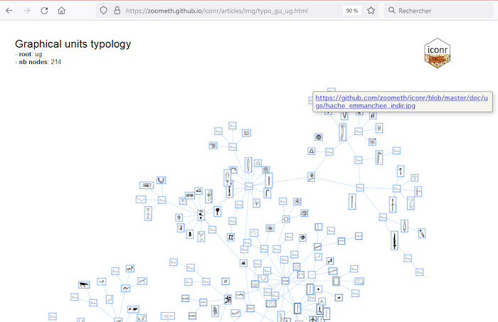

[](https://CRAN.R-project.org/package=iconr)
[](https://joss.theoj.org/papers/e68e041e66a613918f76bf43db3f8b02)
[](https://doi.org/10.5281/zenodo.4767529)
[](https://github.com/zoometh/iconr/actions) [](https://travis-ci.org/zoometh/iconr)
          
# ***iconr*** package <br> modeling Prehistoric iconography 
> Created by [Thomas Huet](mailto:thomashuet7@gmail.com), [Jose M Pozo](mailto:josmpozo@gmail.com), [Craig Alexander](mailto:craiga304@gmail.com)
  
  
The R package ***iconr*** is grounded in graph theory and spatial analysis to offer concepts and functions for modeling Prehistoric iconographic compositions and preparing for further analysis (clustering, typology tree, Harris diagram, etc.). The package purpose is to contribute to cross-cultural comparison through a greater normalization of quantitative analysis.   
  

<center>
  
{width=800px}
  
</center>
  

The theoretical background is as follows: some objects can have a decoration [**1**]. A decoration is composed of graphical units (GUs)[**2**]. Each GU is recorded with a vertex[**3**], and each contiguous vertex (Voronoi cell) is linked with an edge [**4**, **5**]. The whole decoration is considered as a graph and can be analyzed with Graph Theory. As we also favored [GIS entry](https://zoometh.github.io/iconr/articles/gis.html), GIS indexes can also be used. The last version of ***iconr*** (v. 0.1.1) handle POLYGON geometries to perform Geometric Morphometry with the R pakage Momocs
  
 
## How to use

Install ***iconr*** v. 0.1.0 from the CRAN (stable)

```
install.packages("iconr")
```

Or from GitHub (latest developments)

```
devtools::install_github("zoometh/iconr")
```

Functions and examples, for the ***iconr*** v. 0.1.0 (analysis of compositions) are on this [website](https://zoometh.github.io/iconr/articles/index.html). 
The ***iconr*** v. 0.1.1 functions (Geometric Morphometry), are named `morph_*` (morphology) and `conv_*` (conversions). Find their documentation directly on R (eg, `?morph_nds_compar`).  
  
See also, how to [contribute](.github/CONTRIBUTING.md) to the next package release, and how to [report an issue](https://github.com/zoometh/iconr/issues) using the [issue template](.github/ISSUE_TEMPLATE.md).


### Plot a decoration

Set data folder, select the ecoration to be plotted, read files of nodes, edges, and images and plot a decoration

```
dataDir <- system.file("extdata", package = "iconr")
site <- "Brozas" ; decor <- "Brozas"
nds.df <- read_nds(site, decor, dataDir)
eds.df <- read_eds(site, decor, dataDir)
imgs <- read.table(paste0(dataDir, "/imgs.tsv"),
                   sep="\t", stringsAsFactors = FALSE)
plot_dec_grph(nds.df, eds.df, imgs,
              site, decor,
              dir = dataDir,
              lbl.size = 0.4,
              nd.var = "type")
```
  
  

  
### Plot common edges shared by the three first decorations

```
imgs <- read.table(system.file("extdata", "imgs.tsv", package = "iconr"),
                   sep="\t", stringsAsFactors = FALSE)
nodes <- read.table(system.file("extdata", "nodes.tsv", package = "iconr"),
                    sep="\t", stringsAsFactors = FALSE)
edges <- read.table(system.file("extdata", "edges.tsv", package = "iconr"),
                    sep="\t", stringsAsFactors = FALSE)
lgrph <- list_dec(imgs, nodes, edges)
g.compar <- list_compar(lgrph, nd.var="type")
plot_compar(g.compar, c(1, 2, 3), 
            focus = "edges",
            nd.size = c(0.5, 1.5),
            ed.width = c(1, 2.5),
            dir = dataDir,
            img.format = "png")
```

  


### Compare GUs' shapes

The last version of ***iconr*** (v. 0.1.1) imports the [Momocs](https://momx.github.io/Momocs/articles/Momocs_intro.html) package to perform Geometric Morphometry analysis (GMM). The [sample dataset](https://github.com/zoometh/iconr/tree/master/doc/datasets/PPN) is composed on 5 decorated objects, belonging from 4 sites of the Near-East Pre-Pottery Neolithic:


<font size="2" align="left">
<table style="width:100%">
	<tr align="center">
		<td>
				
		</td><td>
				
		</td><td>
				
		</td><td>
				
		</td><td>
				
		</td>
	</tr><tr>
			  <th style="padding:5px">Ain Ghazal, statue 2, cache 2</th>
		    <th style="padding:5px">Ain Ghazal, statue 5, cache 2</th>
		    <th style="padding:5px">Jericho, statue A, cache 195</th>
		    <th style="padding:5px">Kfar Hahoresh, modelled skull</th>
		    <th style="padding:5px">Qarassa, bone wand</th>
	</tr>
	</table>
</font>

#### Resume the GUs geometries

After downloading the [PPNB dataset](https://github.com/zoometh/iconr/tree/master/doc/datasets/PPN), set 'PPN' as the current working directory (`setwd("*my_path*/PPN"")`), convert the 'nodes.csv' Well-Known Text geometries to JPG, and resume information

```
conv_wkt_to_jpg(nodes = nodes)
nodes <- read.csv2("*my_path*/PPN/_out/nodes.csv")
conv_wkt_to_jpg(nodes = nodes)
morph_resume(dataDir = "*my_path*/PPN",
             nodes = nodes)
```
  


#### Compare the different types of GUs

Stack the countours of visage (faces), oeil (eyes), bouche (mouths)

```
conv_wkt_to_jpg(nodes = nodes)
nodes <- read.csv2("*my_path*/PPN/_out/nodes.csv")
conv_wkt_to_jpg(nodes = nodes)
morph_resume(dataDir = "*my_path*/PPN",
             nodes = nodes)
```

<p align="center">
  
  <br>
  
  <br>
  
  <br>
</p>


## Citation

Use the canonical form to cite the package (`citation("iconr")`):
```
@Manual{Huet21pckg,
  title = {iconr: Graphical and Spatial Analysis for Prehistoric Iconography},
  author = {Thomas Huet and Jose Pozo},
  year = {2021},
  note = {R package version 0.1.0},
  url = {https://CRAN.R-project.org/package=iconr},
}
```

The ***iconr*** package has also been published in the [Journal of Open Source Software](https://joss.theoj.org/papers/10.21105/joss.03191) under this BibTex reference:

```
@article{Huet21joss,
  doi = {10.21105/joss.03191},
  url = {https://doi.org/10.21105/joss.03191},
  year = {2021},
  publisher = {The Open Journal},
  volume = {6},
  number = {61},
  pages = {3191},
  author = {Thomas Huet and Jose M. Pozo and Craig Alexander},
  title = {Analysis of Prehistoric Iconography with the R package iconr},
  journal = {Journal of Open Source Software}
}
```


## Next release

### Typology of GUs

***iconr*** aims to use a hierarchical _thesaurus_ (tree-like) with controlled vocabularies for GUs' typology . Identity between GU name and value must be unique (URL). See for example the whole typological tree:

<center>
   
[](https://zoometh.github.io/iconr/articles/img/typo_gu_geometrique.html)
  
</center>
  
  
Or these different subtrees: [geometric](https://zoometh.github.io/iconr/articles/img/typo_gu_geometrique.html), [figurative](https://zoometh.github.io/iconr/articles/img/typo_gu_figuratif.html), [zoomorphic](https://zoometh.github.io/iconr/articles/img/typo_gu_zoomorphe.html), 
[technomorphic](https://zoometh.github.io/iconr/articles/img/typo_gu_technomorphe.html), or [anthropomorphic](https://zoometh.github.io/iconr/articles/img/typo_gu_anthropomorphe.html). Such a structure should also be used for other fields than the GU type (eg, 'technique'). Multi-linguism equivalences -- starting with English --, metadata insertion (EXIF) and standardization of the vocabulary (Dublin Core, CIDOC-CRM) is needed

### Superimpostions

The *diachronic* edge `->-` allows to register the superimposition. The next ***iconr*** will integrate an on-the-fly function allowing to create Harris matrices of GUs when such an edge exists. For example here, the Ibahernando stele shows a Latin writing overlaping a spear and a shield representations

<p align="center">
  
</p>

