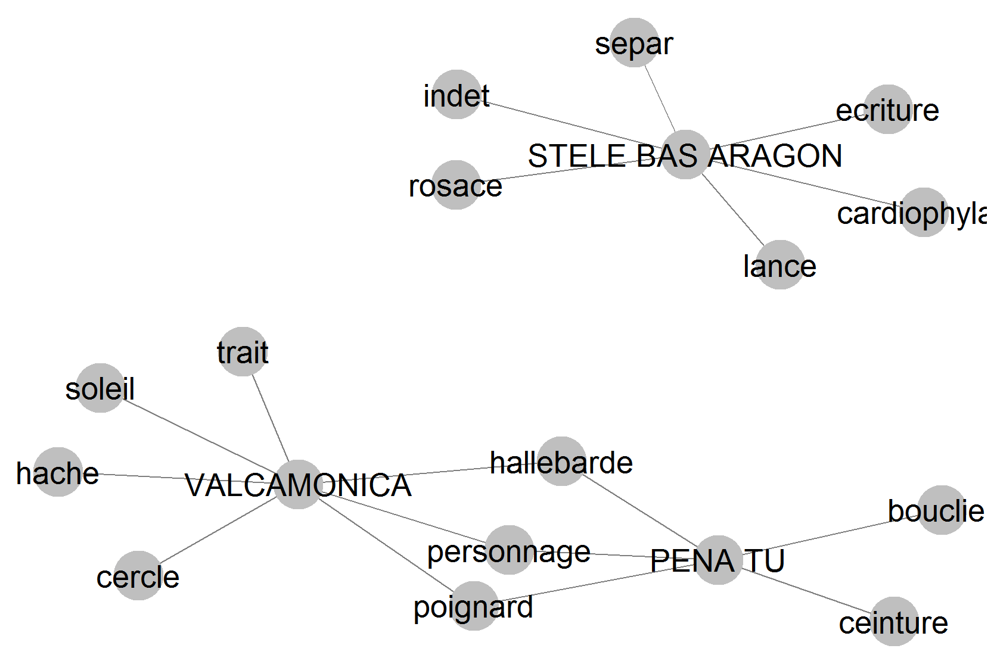

# _iconr_ package

## documentation

  - [ ] Spell checking, remove glitches, etc., of the [vignettes](https://zoometh.github.io/iconr)

## next developments

Define work groups

  - [ ] [Shape analysis](https://zoometh.github.io/iconr/articles/next.html#shape-analysis-1)
  Perform shape analysis on GUs

  - [ ] [Typology](https://zoometh.github.io/iconr/articles/next.html#typology-1)
  Create a hierachical _thesaurus_ creation of GUs' typologies

  - [ ] [Harris Matrix](https://zoometh.github.io/iconr/articles/next.html#harris-matrix-1)
  Perform Harris matices of GUs

# Collaborations {#col}

Ask the following scholars and specialists to collaborate drawing graphs on a selection of decoration. Decorative contents will be addressed and compare by periods, families, themes and techniques

  
   
    <em>families x themes</em>

see: [families examples](https://epispat.shinyapps.io/decoration_graph)

## By families (ordered chronologically)

Each collaborator could choose between:

1. **3 or more decorations**: qualitative analysis

2. **7 or more decorations**: semi-quantitative analysis (ie. rank-based, non-parametric tests: Mann-Withney, Spearman, etc.)

3. **30 or more decorations**: quantitative analysis (ie. mean-based, parametric tests: Shapiro-Wilk, Student, etc.)

### Families

Any consensual group of decorations.

  - [ ] Palaeolithic cave rock-art: 
    - France: [Julien Monney](http://theses.fr/184904846)
    - Spain: [Aitor Ruiz-Redondo](https://southampton.academia.edu/AitorRuizRedondo)
    
  - [ ] Palaeolithic portable art: ...
  
  - [ ] Azilian painted peebles: ...
  
  - [ ] Near East PPNB painting: ...
  
  - [ ] Early Neolithic anthromorph potteries:
    - [Johanna Recchia](https://www.theses.fr/236657178)
    
  - [ ] Levantine/Macro-Schematic rock-art: 
    - Ines Domingo Sanz, Esther Lopez-Montalvo
    
  - [ ] Chalcolithic stelae (Rouergue, Provence, Languedoc): 
    - [Jules Masson Mourey](http://www.theses.fr/s163490)
    
  - [ ] Schematic rock-art: 
    - France: [Claudia Desfrasne](https://lampea.cnrs.fr/spip.php?article3640)
    - Spain: ...
    
  - [ ] Cups-and-rings: 
    - Bretagne: Serge Cassen
    - Galicia (`PENA TU`, etc.): ...
    - Great Britain: Guillaume Robin, Aron Mazel, Marta Diaz-Guardamino 
    
  - [ ] Scandinavian rock-art:
    - [Johan Ling](https://www.ancientportsantiques.com/wp-content/uploads/Documents/PLACES/UK-EUNorth/CopperScandinavia-Ling2015.pdf)
    - [Nimura, Courtney](https://www.researchgate.net/publication/305391767_Rock_art_and_coastal_change_in_Bronze_Age_Scandinavia/figures?lo=1)
    - [Gjerde J.](https://munin.uit.no/bitstream/handle/10037/2741/401-506gjerde-thesis-5.pdf?sequence=8&isAllowed=y)
  
  - [ ] Mycenian potteries with figurative decorations: ...
  
  - [ ] Warrior Stelae: 
    - Marta Diaz-Guardamino
  
  - [ ] Mailhac potteries with figurative decorations: ...
  
  - [ ] First Iron Age potteries with figurative decorations (Sopron, Darslup, etc.): ...
  
  - [ ] Second Iron Age "bas aragon" stelae (`STELE BAS ARAGON`, etc.): ///
    
## By sites (ordered chronologically)

  - [ ] Mount Bego: 
    - Nicoletta Bianchi
  - [ ] Valcamonica (`VALCAMONICA`):
    - Alberto Marretta
    - Andrea Arca
    - Paolo Rondini
  - [ ] Morro du Chapéu: ...
    
## By geographical areas
 
  - [ ] Australian arborigen rock-art:
    - Ines Domingo Sanz
  - [ ] South African San rock-art: 
    - Aron Mazel
  - [ ] Australian churingas: ...
  - [ ] Tihuanacu potteries with figurative decorations: ...
  - [ ] Aztec codex: ...
  - [ ] Native Americans sustaining memory paintings (e.g. Dakota Bible): ...
  
## By themes

 - [ ] "Maps":
   - Andrea Arca
   
# Publishing {#pub}

## Briefing notes

  - [ ] [Bulletin de la Société Préhistorique Française - Actualités (*scientific news*)](https://www.jstor.org/journal/bullsociprehfran)

  - [ ] [INORA newsletter](https://www.icomos.org/en/resources/publicationall/165-articles-en-francais/centre-de-documentation/557-inora-international-newsletter-on-rock-art) (NOT SURE IT STILL PUBLISH)

## Papers in scientific reviews

### IT and Methods

  - [ ] [JSS](https://raw.githubusercontent.com/zoometh/jss_iconr/main/article_rvTH17.pdf) 
  or
  - [ ] [JOSS](https://joss.theoj.org/)
  
### Prehistorical issues

  - [ ] [JAMT](https://www.springer.com/journal/10816) 
