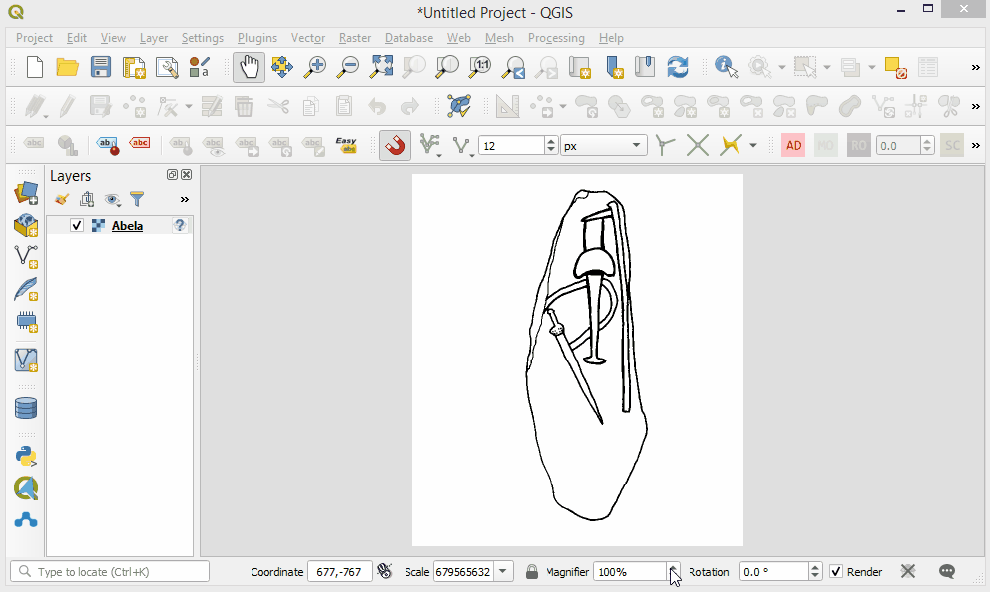

```{r setup, include=FALSE}
knitr::opts_chunk$set(echo = TRUE)
```


## Open Image with **QGIS**
  
Open the decoration in QGIS. The width of the image is equivalent to the x-axis, the height of the image is equivalent to the y-axis
  
<center>


</center>
  
The QGIS coordinates are:

* top-left: origins (0,0)

* top-right: (666,0)

* bottom-right: (666,750)

* bottom-left: (0,750)  
  

<center>

{width=66%}

</center>
  
# Open Image with ***magick*** R package

Read the decoration image with the R magick package and show image proprieties

```{r echo=TRUE, message=FALSE, warning=FALSE}
library(knitr)
library(kableExtra)
library(magick)
path_img <- "D:/Sites_10/Abela/Abela.jpg"
img <- image_read(path_img)
image_info(img)
```

Plot the image
  

```{r echo=TRUE, out.width="60%", fig.width=6, fig.asp=750/666}
plot(image_trim(img))
```

Add the coordinates of the image four corners:

* top-left

* top-right

* bottom-right

* bottom-left

```{r echo=TRUE, out.width="60%", fig.width=6, fig.asp=750/666}
# par(mar = c(0,0,0,0))
plot(img)
box(lwd = 2)
# min width & min height (origin)
text(0, 0, 
     paste0(0, ",", 0),
     cex = 1, adj = c(0, -0.2))
# min width & max height
text(0, image_info(img)$height,
     paste0(0, ",", image_info(img)$height),
     cex = 1, adj = c(0, 1.1))
# max width & min height
text(image_info(img)$width, 0,
     paste0(image_info(img)$width, ",", 0),
     cex = 1, adj = c(1, -0.2))
# max width & max height
text(image_info(img)$width, image_info(img)$height,
     paste0(image_info(img)$width, ",", image_info(img)$height),
     cex = 1, adj = c(1, 1.1))
```

