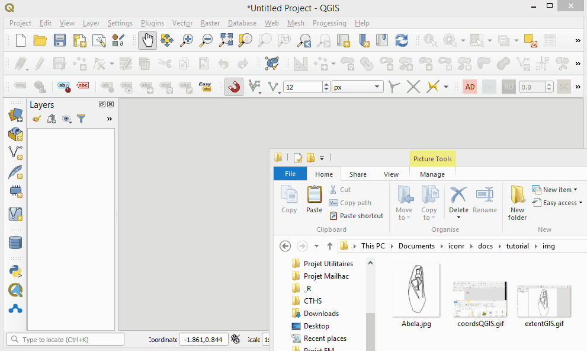
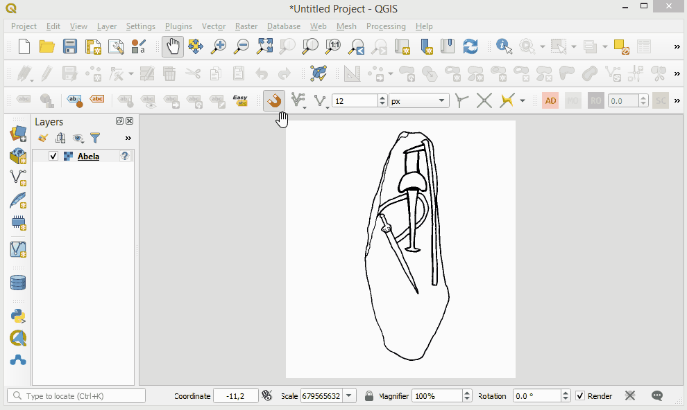
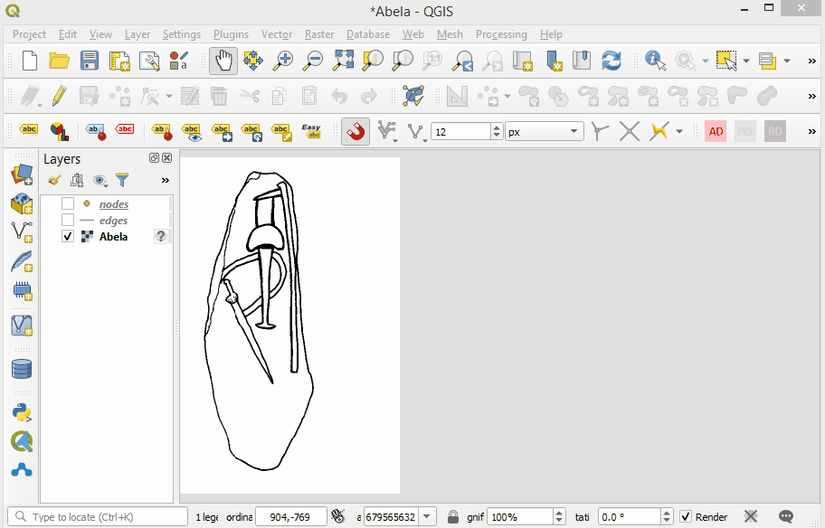
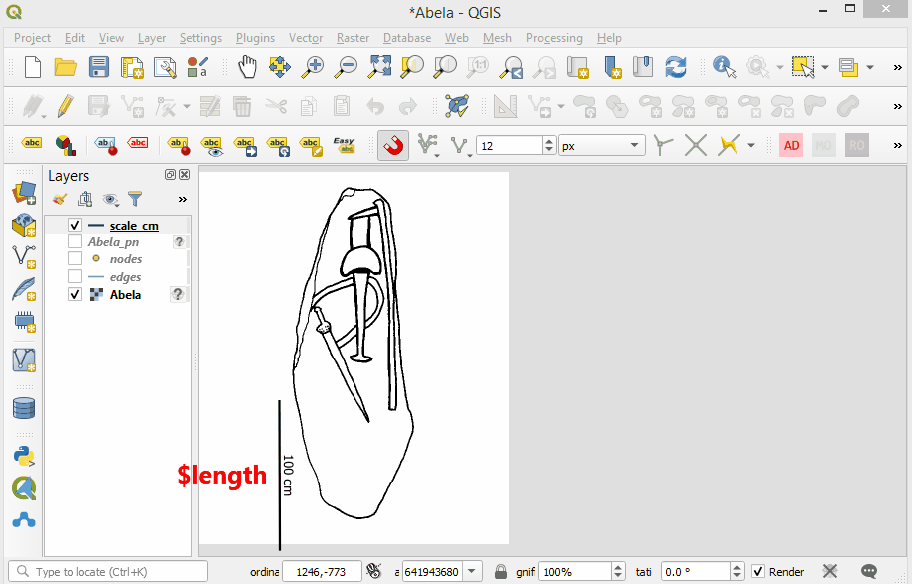
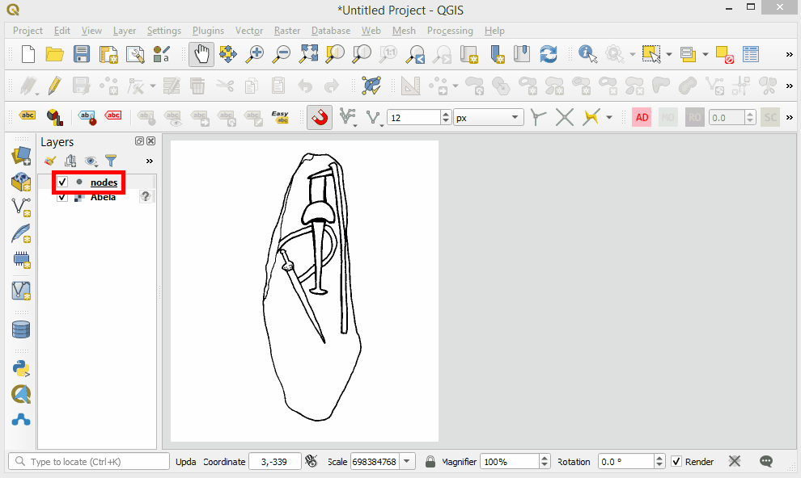
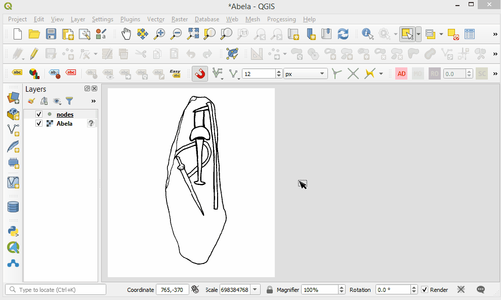
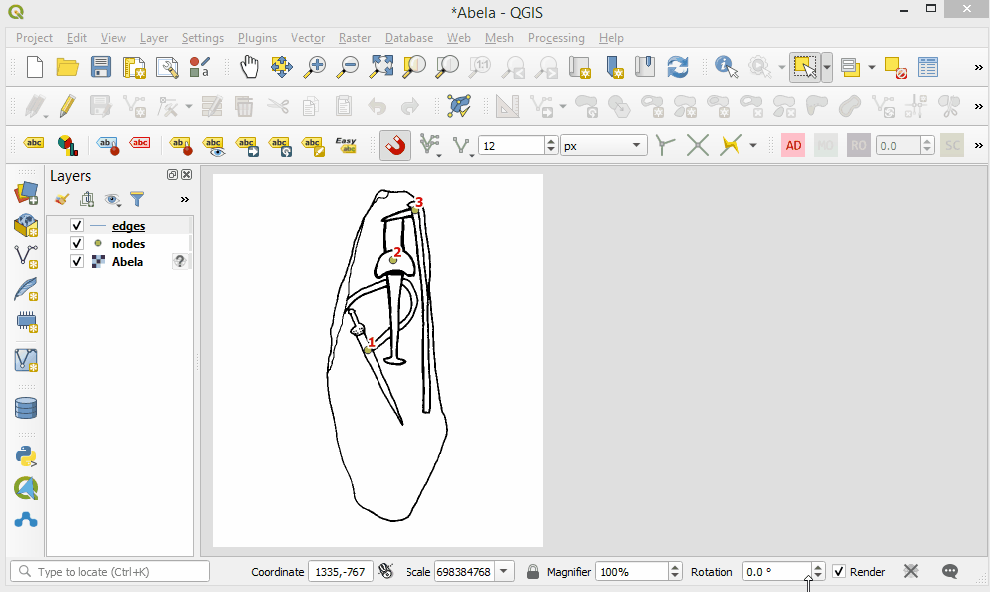
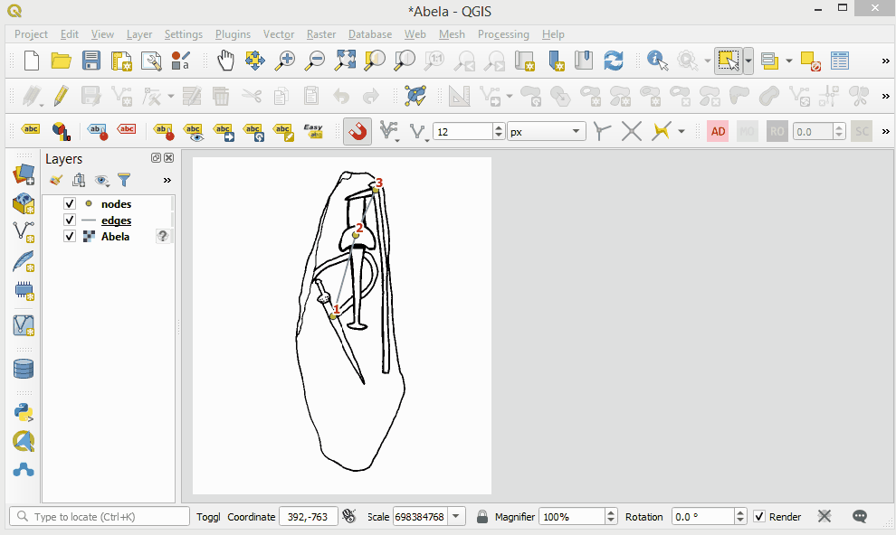
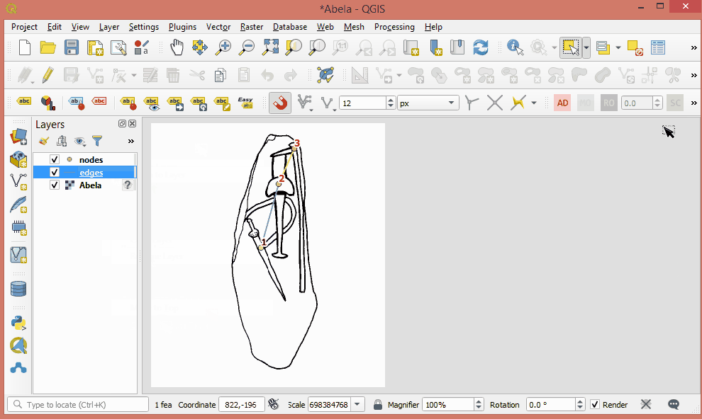

```{r, echo=FALSE}
# print(getwd())
# print(file.path("../logo", "iconr_logo.png"))
htmltools::img(src = knitr::image_uri(file.path("../man/figures", "iconr_logo.png")),
# htmltools::img(src = knitr::image_uri(file.path("img", "iconr_logo.png")), 
# htmltools::img(src = knitr::image_uri(file.path(R.home("doc"), "html", "logo.jpg")), 
               alt = 'logo', 
               style = 'position:absolute; top:0; right:0; padding:10px;')
```

---

<style>
.figure {
   margin-top: 0px;
   margin-bottom: 40px;
}
table {
    margin-top: 0px;
    margin-bottom: 24px;
}
</style>


```{r setup, include=FALSE}
knitr::opts_chunk$set(echo = TRUE)
library(knitr)
library(kableExtra)
library(dplyr)

solanas.vor.path <- "../doc/tutorial/img/all_process.gif"
```
  

Any iconographic contents can be modeled with a geometric graph where nodes, also called **graphical units (GUs)**, linked together with edges and then analyzed with the **Graph Theory** and spatial analysis at the support scale.

# Forewords

The ***iconr*** R package grounds concepts and provides normalized tools to manage iconographic contents. This modeling is particularly interesting for compositions coming from Paleolithic, Neolithic and Protohistoric times [@Alexander08; @HuetAlexander15; @Huet18a]. To record large series of iconographic contents, the [GIS interface](#gis) appears to be the most appropriate one for users. This demo explains how to construct the graph _before_ using the package, offering also tipping points to facilitate the recording process.

<center>

![GIS view. A Late Bronze Age stelae (Solana de Cabañas, Cáceres, Spain).Stelae photograph (photograph credits: Museo Arqueológico Nacional, Madrid); Georeferencing of the steale drawing over its photograph (drawing credits: Diaz-Guardamino 2010); Binarization and polygonization/vectorization of the graphical content (graphical units, GUs) of the stelae (now `POLYGONS`); Calcul of their centroid (red points); Calcul of their Voronoi cells; Binary topological relationships (*birel*) for each pairwise of Voronoi cells: the ones that share a border (*touches* = TRUE) will share a link (ie, edge, in red) between their centroids (ie, nodes); Identification of the different types (nodes' column `type`)](`r solanas.vor.path`)

</center>


# A GIS ? Yes but why ? {#gis}

The *tenet* of the ***iconr*** is to always keep the user connected with the iconographic content -- his primary data source -- and emphasize the significance of the spatial dimension for any graphical content. Geographical Information Systems (GIS) offer multiple tools and options to facilitate the data entry.  Use of GIS offers a graphic interface and ensures the correctness of spatial relationships between GUs. It forms a permanent interface between the image of he decoration and the database. Obviously, the main GIS facility is the presence of **attributes tables** which allow to record, filter and sort GUs on many information: types, techniques, orientations, lengths, etc. 

The other most important GIS facilities for the recording process are:

* edition tools
  + snapping tools  
  
* scale tools (see [Absolute scale](#scale.abs))
  + measurement tools
  + georeferencing tools

From far, our software preference goes to [QGIS](https://www.qgis.org/fr/site/), because it is open source, offers a large rank of database connections facilities (with PostGRES/GIS for example), has a large user community, but also because the source file is a XML (.qgs, .qgz) structure that can be parsed, modified, copied and moved with scripting languages like R and Python

# Always start with an **image**

The image will be the reference space of the graph. So, before anything, start by opening the image decoration into the GIS. In this tutorial we will take the example of the South Western Iberian **Abela stela** dated to the Middle Bronze Age. The original drawing can be download [here](https://github.com/zoometh/iconr/blob/master/docs/tutorial/img/Abela.jpg) [@DiazGuardamino10]


<center>
  
{width=70%}
</center>
  

## Scales

Use of GIS easy the scaling process. The creation of a spatialized graph permit to combine network analysis with spatial analysis of the graphical content

### Relative scale {#scale.rel}

The image extent is measured in pixels with a top-left corner origin (0,0). The coordinates system is irrelevant: image, nodes and edges are measured on the pixel grid


<center>

{width=70%}
</center>

### Absolute scale {#scale.abs}

To retrieve to true scale of the decoration, one can create a scale bar and apply a simple rule of three to convert pixels into centimeters, or meters. For example, if the scale belongs to another drawing, you can import it and 'georeferenced' it on the original drawing with the [*Freehand raster georeferencer* plugin](https://gvellut.github.io/FreehandRasterGeoreferencer/), and then create the scale bar

<center>

{width=70%}

</center>

Parallely, the dimensions of each GU can be measured with the QGIS **Measure Line** tool. At first, only the maximum length of the GU is important. It has also to be noted that if a Polygonization is done on the GUs, the maximum length -- between all other type of shape analysis indexes -- do not have to be calculated 

<center>

{width=70%}

</center>

To retrieve the real dimensions of each GUs, first get the pixel sizes with the Measure line tools, then apply a simple rule of three with:

1. the size of the scale in pixels (native QGIS function `$length`)
2. the real size of the scale in cm (here, 100 cm)
3. the size of each GUs in cm


# **Nodes** and **edges** tables

[Nodes](#nodes) and [edges](#edges) are the graph elements. At first, we have to create attribute tables for each of them. For example the nodes shapefiles:


<center>
  
{width=70%}
  
</center>

In the GIS, [add a node](#graph.enodes.add) for each GUs and [add an edge](#graph.edges.add) between two contiguous GUs. Always start with the nodes

## Nodes {#nodes}

**Nodes** represent the basic information of the graphical content. For example, it would be easy to distinguish a decoration with aurochs (`type = auroch`) from a decoration with swords (`type = sword`). The former iconographic content should be probably related to the Late Paleolithic/Early Neolithic while the second one is more probably related to a period starting with the Bronze Age. Nodes are created as a shapefile of `POINTS`. The attribute table of the nodes has at least four (4) fields:

1. `site` (Text): name of the site
2. `decor` (Text): name of the decoration
3. `id` (Integer): node identifier
4. `type`(Text): one of the relevant characteristics of each node

The nodes are created near the centroids of each different graphical units (GUs).

<center>
  
{width=70%}
  
</center>

In this example, beside the *main* nodes sword (`epee`), anciform (`anciforme`) and halberd (`hallebarde`), we can also observe that the sword is connected to a belt and the anciform is worn as necklace. We probably would like to register this piece of graphical content as we also probably would like to characterize the types of blades for the sword and halberd, point out the presence of rivets on the sword depiction, etc. To do so, create 'Attribute edges' (`-+-`)

## Edges {#edges}

**Edges** types (field `type`) give information on nodes relative locations and on the nature of these nodes (main node *vs* attribute node, overlapping *vs* overlapped node, etc.). Edges are created as a shapefile of `LINES`. Edges attribute table has at least five (5) fields:

1. `site` (Text): name of the site
2. `decor` (Text): name of the decoration
3. `a` (Integer): *starting* node
4. `b` (Integer) *ending* node
5. `type` (Text): values `=`, `+` or `>`; textual notation `-=-`, `-+-` or `->-`

Theoretically, between two *main* nodes, edges exist when their Voronoi cells are contiguous. In practice, if you consider that two GUs are neighbors, you can create an edge between their two nodes: GIS snapping tool help !

<center>
  
{width=70%}
  
</center>


## Summary

For the Abela decoration, we have created three (3) nodes (`1`,`2`,`3`) and two (2) *normal* edges (`1-=-2`,`1-=-2`). We named the nodes shapefile `nodes.shp` and the edges shapefile `edges.shp` because this is their default name in the ***incor*** package

<center>
  
{width=70%}
  
</center>

# The **table of decorations**

The **table of decorations** is a correspondence table which records joins between nodes and edges dataframes. In the package, the default name of this table is `imgs.tsv`, a tabulate separated-values (but it also can be a`.csv`, comma separated-values)

<center>
  
{width=70%}
  
</center>

The **table of decorations** has four (4) mandatory fields:

1. `idf` (Integer): short name of the decoration
1. `site` (Text): name of the site
2. `decor` (Text): name of the decoration
4. `img` (Text): name of the drawing/photograph/...


# References

