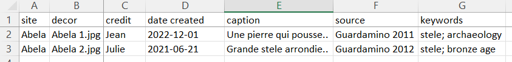
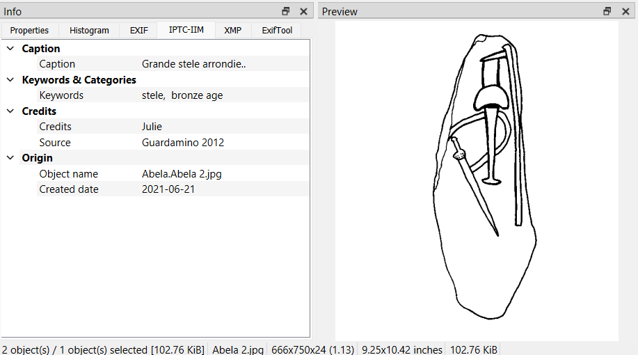

# ***iconr*** development

## Image metadata

The purpose is to record metadata into images.  

The Python script [`metadata_1.py`](https://github.com/zoometh/iconr/blob/master/doc/dev/metadata/metadata_1.py) loops over the row of the `steles_metadata.xlsx` file where the identifier of the steles, and the IPTC metadata are recorded

After running the Python script, the IPTC metadata are embedded into the images

