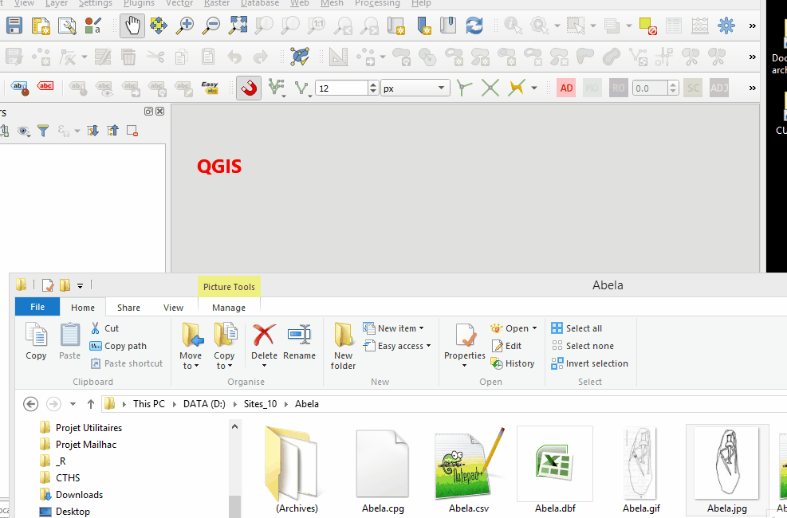

<style>
.figure {
   margin-top: 0px;
   margin-bottom: 20px;
}
table {
    margin-top: 0px;
    margin-bottom: 24px;
}
</style>


```{r setup, include=FALSE}
knitr::opts_chunk$set(echo = TRUE)
solanas.vor.path <- "img/all_process.gif"
```
  

Any iconographic contents can be modeled with a geometric graph where nodes, also called **graphical units (GUs)**, linked together with edges and then analyzed with the **Graph Theory** and spatial analysis at the support scale [@Alexander08; @HuetAlexander15; @Huet18a]


The ***iconr*** R package grounds concepts and provides normalized tools to manage iconographic contents. To record large series of iconographic contents, the **GIS interface** appears to be the most appropriate one for users. This tutorial explains how to construct the graph _before_ using the package ***iconr***.  
  
This tutorial offers also tipping points to facilitate the recording process. The chapter '[Dataset](https://zoometh.github.io/iconr/docs/#Dataset)' of the  ***iconr*** documentation can complete the present tutorial.

<center>

![GIS view. Detail of a Late Bronze Age stelae (Solana de Cabañas, Cáceres, Spain). From left to right: stelae photograph (photograph credits: Museo Arqueológico Nacional, Madrid); Georeferencing of the steale drawing over its photograph (dawing credits: Diaz-Guardamino 2010); Binarization and polygonization/vectorization of the graphical content of the steale (now `POLYGONS`); Calcul of their centroid; Calcul of their Voronoi cells; Binary topological relationships (*birel*) for each pairwise of Voronoi cells: the ones that share a border (*touches* = TRUE) will share a link (ie, edge) between their centroids (ie, nodes); Identification of the different types (nodes' column `type`)](`r solanas.vor.path`)

</center>

GIS offer multiple tools and options to facilitate the data entry.  Use of GIS offers a graphic interface and ensures the correctness of spatial relationships between GUs. Here, we only focus on the most basic ones and point out the possible short cuts or good practices. Obviously, the main GIS facility is the presence of **attributes tables** which allow to record, filter and sort GUs on many information: types, techniques, orientations, lengths, etc. The other most important GIS facilities for the recording process are:

* the snapping tools
* the measurement line
* the georeferencing tools
* 


## Always start with an **image**

The *tenet* of the ***iconr*** is to always keep the user connected with the iconographic content -- his primary data source -- and emphasise the significance of the spatial dimension for any graphical content.The image will be the reference space of the graph. So, before anything, start by opening the image decoration into a GIS (for example QGIS), or [downloading the training decoration from GitHub](https://github.com/zoometh/iconr/blob/master/docs/tutorial/img/Abela.jpg)

<center>

{width=70%}
</center>

Whether it is not mandatory -- and not available in all GIS -- you can check the box **Non projection (or unknown/non-Earth projection)**. The projection system will not affect the next step.  

### Relative scale

The image extent is measured in pixels with a top-left corner origin (0,0). 

<center>

{width=70%}
</center>

### Absolute scale

To retrieve to true scale of the decoration, you can create a scale bar and apply a simple rule of three to convert pixels into centimeters or meters. For example, if the scale belongs to another drawing, you can import it and 'georeferenced' it on the original drawing with the [*Freehand raster georeferencer* plugin](https://gvellut.github.io/FreehandRasterGeoreferencer/), and then create the scale bar

<center>

{width=70%}

</center>

To retrieve the real dimensions of each GUs, first get the pixel sizes with the Measure line tools, then apply a simple rule of three with:

* the size of the scale in pixels (native QGIS function `$length`)
* the real size of the scale in cm (here, 100 cm)
* the size of each GUs in cm

<center>

{width=70%}

</center>

## Create attribute tables and add graph elements

**Graph elements are nodes and edges**. At first, we have to create the attribute tables:

### Nodes

**Nodes** represent the basic information of the graphical content. For example, it would be easy to distinguish a decoration with aurochs (`type = auroch`) from a decoration with swords (`type = sword`). The former iconographical content should be probably related to the Late Paleolithic/Early Neolithic while the second one is more probably related to a period starting with the Bronze Age. Nodes are created as a shapefile of `POINTS`. The attribute table of the nodes has at least four (4) fields:

1. `site` (Text)
2. `decor` (Text)
3. `id` (Integer)
4. a relevant characteristics of each node, like its `type` (Text)

<center>
  
{width=70%}
  
</center>

The nodes are created near the centroids of each different graphical units (GUs).

<center>
  
{width=70%}
  
</center>

In this example, beside the *main* nodes sword (`epee`), anciform (`anciforme`) and halberd (`hallebarde`), we can also observe that the sword is connected to a belt and the anciform is worn as necklace. We probably would like to register this piece of graphical content as we also probably would like to characterize the types of blades for the sword and halberd, point out the presence of rivets on the sword depiction, etc. To do so, see the [Attribute edges](https://zoometh.github.io/iconr/docs/#Edge_types) part of the ***iconr*** package documentation

### Edges

**Edges** give information on the relative location of each node and, depending on their `type` value, give information on the nature of the nodes (main node *vs* attribute node, overlapping *vs* overlapped node, etc.). Edges are created as a shapefile of `LINES` and the **edges** table attributes is created in the same way as nodes. Edges attribute table has at least five (5) fields:

1. `site` (Text)
2. `decor` (Text)
3. `a` (Integer)
4. `b` (Integer)
5. `type` (Text)

Theoretically, between two *main* nodes, edges exist when their Voronoi cells are contiguous. In practice, if you consider that two GUs are neighbors, you can create an edge between their two nodes

<center>
  
{width=70%}
  
</center>

To understand the structure of the attribute table of the edges, see the [Edge data](https://zoometh.github.io/iconr/docs/#Edge_data) documentation part of the ***incor*** documentation. To understand the different types edges (field `type`, values`=`, `+` or `>`), see the [Edge types](https://zoometh.github.io/iconr/docs/#Edge_types) part 


See the [Node data](https://zoometh.github.io/iconr/docs/#Node_data) and  parts of the ***incor*** documentation

Their coordinates system are irrelevant: their coordinates are measured in pixels (like the decoration image). 


## 

In the GIS, [add a node](#graph.enodes.add) for each GUs and [add an edge](#graph.edges.add) between two contiguous GUs. Always start with the nodes.


### Summary

For the Abela decoration, we have created three (3) nodes (`1`,`2`,`3`) and two (2) *normal* edges (`1-=-2`,`1-=-2`). We named the nodes shapefile `nodes.shp` and the edges shapefile `edges.shp` because this is their default name in the ***incor*** package

<center>
  
{width=70%}
  
</center>

## Create the **table of decorations**

A dataframe, the **table of decorations**, record the joins between nodes and edges dataframes. The default name of the **table of decorations** is `imgs.tsv` in the ***incor*** package, a tabulate separated-values (but it also can be a`.csv`, comma separated-values)

<center>
  
{width=70%}
  
</center>

The **table of decorations** has four (4) mandatory fields:

1. `idf` (Integer)
2. `site` (Text)
3. `decor` (Text)
4. `img` (Text)

To understand the meaning of these fields, see the [Table of decorations](https://zoometh.github.io/iconr/docs/#Table_of_decorations) part of the ***incor*** documentation

## Start to work with the ***incor*** package

Now we have at least one decoration modeled with a geometric graph, we can start to use the ***incor*** package. Its latest development version with its documentation (vignette) can be downloaded from GitHub

```{r down,eval=FALSE, echo=TRUE}
devtools::install_github("zoometh/iconr", build_vignettes=TRUE)
```

And load the package

```{r echo=TRUE}
library(iconr)
```

To start using the package, you have first to locate your working directory. For example:

```{r echo=TRUE}
dataDir <- paste0(getwd(), "/extdata")
```

The you can start with the function `plot_dec_grph()` and specifying the extensions of the nodes and edges data (`shp`)

```{r echo=TRUE, out.width="60%", fig.width=8, fig.asp=750/666, fig.align="center", warning=FALSE, fig.cap="Abela stelae"}
# Decoration to be plotted
site <- "Abela"
decor <- "Abela"
# Read nodes, edges, and decorations
nds.df <- read_nds(site, decor, dataDir, format = "shp")
eds.df <- read_eds(site, decor, dataDir, format = "shp")
imgs <- read.table(paste0(dataDir, "/imgs.tsv"),
                   sep="\t", stringsAsFactors = FALSE, header = T)

# Save the plot of nodes and edges with node variable "type" as labels
# in png image format and return the image file name.
plot_dec_grph(nds.df, eds.df, imgs,
              site, decor,
              dir = dataDir,
              nd.var = "type")
```

# Summary

Once you record all your dataset (nodes, edges, table of decoration and images), you can use the ***iconr*** package

